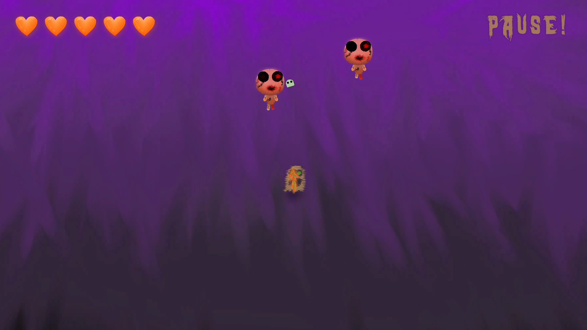

# Spookland
Top Down 2D shooter game created on unity. 
This is a 2D shooter game with waves system, you need to finish all the waves and fight the final boss in order to win the game. 
Try and see now! 
## Screenshots

## Tools used while developing this project
- Unity.
- Visual Studio Code. Coding in C# Programming Language.
- GitBash.
- Inno Setup Compiler (For creating installer files)
- Photoshop (For drawing some of the assets)
### For Windows User
- Open Folder Named "Game" in Spookland repository.
- Proceed to Windows Folder.
- Click on Spookland.exe and download.
- Most probably you will face a warning message. Just Right click on warning and click "Save".
- Now you have an installer file! Open it.
- Windows Defender will prevent running it. Click "More Info" and Click "Run Anyway".
- Proceed with installing and enjoy the game!
### For Mac User
- Open Folder Named "Game" 
- Proceed to Mac and download zip file
- Right click on downloaded file and Open.
- Enjoy the game!
## Contacts 
- E-mail address orkhan.elchuev@gmail.com
- https://github.com/OrkhanElchuev/Spookland
## Aknowledgements
- [dafont](https://www.dafont.com/de/)
- [LunaPic](https://www6.lunapic.com/editor/)
